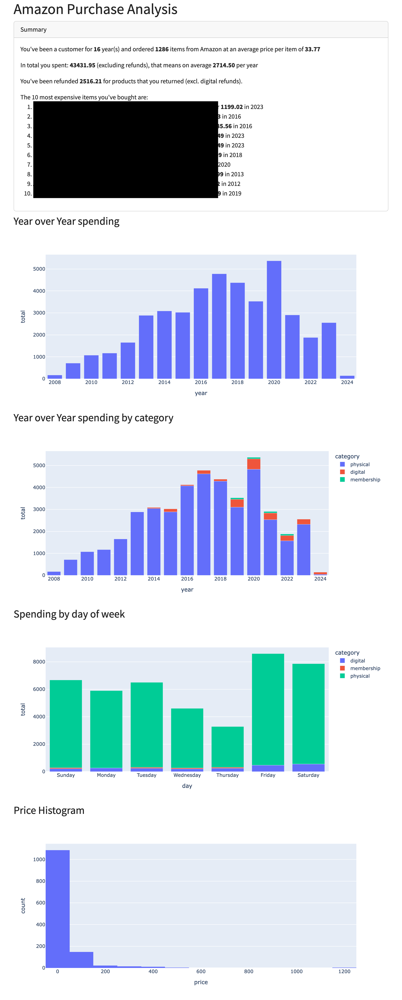

# Analyze your Amazon purchases

The tools in this repository help you analyze your Amazon Data Export.



## Usage

1. Clone this repository
2. (Optional, but recommended) create and activate a new virtual environment
   1. `python3 -m venv .venv`
   2. `source .venv/bin/activate`
3. Run `pip install .` (or `pip install -r requirements-dev.txt` if you want to extend it)
4. Run `parse-export PATH_TO_EXPORT OUTPUT_FILE` with `PATH_TO_EXPORT` being the unzipped data export and `OUTPUT_FILE` being something like `data.json`
5. Run `visualize-parsed PATH_TO_OUTPUT_FILE` with `PATH_TO_OUTPUT_FILE` being the value of `OUTPUT_FILE` from above
6. Navigate to http://127.0.0.1:8050/ in your Browser

## CLI Tools

### parse-export

```text
$ parse-export -h
usage: parse-export [-h] REPORT_DIR OUTPUT_FILE

Parse an Amazon Data Export and create a report.

positional arguments:
  REPORT_DIR   Path to the Unzipped Report files
  OUTPUT_FILE  Filename to save the changes under.

options:
  -h, --help   show this help message and exit
```

### visualize-parsed

This CLI tool starts a Dash Webapp based on the output of `parse-export` that visualizes your spending.

```
$ visualize-parsed -h
usage: visualize-parsed [-h] [--debug] REPORT_FILE

Visualize the parser output in a webapp, by default it will be hosted on http://127.0.0.1:8050, you can update that through the HOST and PORT environment variables.

positional arguments:
  REPORT_FILE  Path to the output of the parser

options:
  -h, --help   show this help message and exit
  --debug      Enable the Dash Debug functionality.
```

