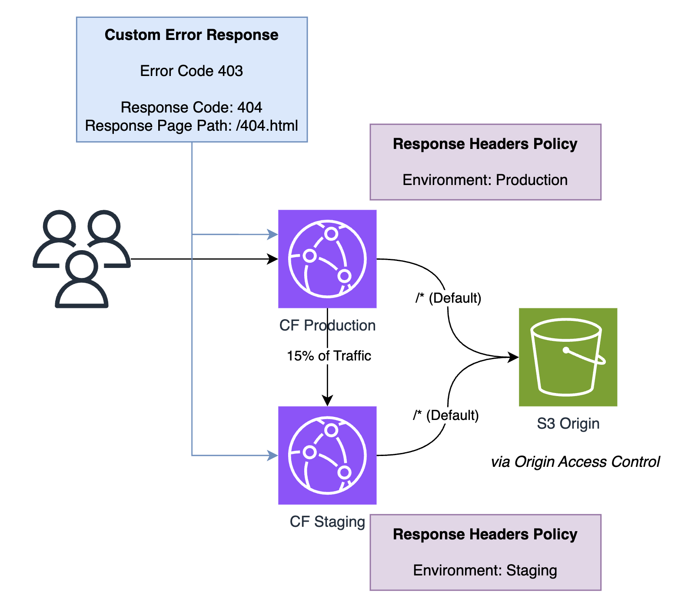

# CloudFront Bug Reproduction

## Architecture

Contents of the `static` directory are deployed to S3 bucket. 

## Prerequisites

- npm / nodejs
- terraform / open tofu

## Setup

1. Check out the repository
1. Run `npm i` to install artillery
1. Run `tofu init` to initialize OpenTofu (or use terraform)
1. Open `cloudfront.tf` and comment out the line that starts with `continuous_deployment_policy_id=` (needs to be enabled later)
1. Run `tofu apply` and confirm for the initial deployment
1. Open `cloudfront.tf` and uncomment the line that starts with `continuous_deployment_policy_id=`
1. Run `tofu apply` and note the CloudFront URL.

The initial deployment has enabled the custom error response on both the production and the staging distribution.
To adjust this, edit `cloudfront.tf` and run `tofu apply`.

**Running the Load Test**

1. Run `artillery run load_test.yml -t https://<cloudfront_url_without_trailing_slash>`, replace the placeholder
1. Wait until the run completes

## Scenarios / Results

- [Custom Error Response on Production and Staging](./summary_prod_and_staging.txt)
- [Custom Error Response only on Production](./summary_prod_only.txt)
- [Custom Error Response only on Staging](./summary_staging_only.txt)
- [No Custom Error Responses](./summary_no_custom_errors.txt)
- [Custom Error Response on Production only (Peak Traffic Hours)](./summary_prod_only_no_errors.txt)
- [Sample Error Message](./sample_500_error.html)

| Custom Error Enabled (Production) | Custom Error Enabled (Staging) | HTTP 500 (Production) | HTTP 500 (Staging) |
| ------------------------------------ | --------------------------------- | ------------------------ | --------------------- |
| Yes                                  | Yes                               | ~15%                     | ~83%                  |
| Yes                                  | No                                | None                     | ~47%                  |
| No                                   | Yes                               | ~13%                     | None                  |
| No                                   | No                                | None                     | None                  |
| Yes                                  | No                                | None (Peak Traffic)      | None (Peak Traffic)   |

<!-- BEGIN_TF_DOCS -->
## Requirements

| Name | Version |
|------|---------|
|  [aws](#requirement\_aws) | ~> 6.0 |

## Providers

| Name | Version |
|------|---------|
|  [aws](#provider\_aws) | 6.11.0 |

## Modules

| Name | Source | Version |
|------|--------|---------|
|  [static\_files](#module\_static\_files) | hashicorp/dir/template | 1.0.2 |

## Resources

| Name | Type |
|------|------|
| [aws_cloudfront_cache_policy.static_cache_policy](https://registry.terraform.io/providers/hashicorp/aws/latest/docs/resources/cloudfront_cache_policy) | resource |
| [aws_cloudfront_continuous_deployment_policy.weighted](https://registry.terraform.io/providers/hashicorp/aws/latest/docs/resources/cloudfront_continuous_deployment_policy) | resource |
| [aws_cloudfront_distribution.production_distribution](https://registry.terraform.io/providers/hashicorp/aws/latest/docs/resources/cloudfront_distribution) | resource |
| [aws_cloudfront_distribution.staging_distribution](https://registry.terraform.io/providers/hashicorp/aws/latest/docs/resources/cloudfront_distribution) | resource |
| [aws_cloudfront_origin_access_control.oac](https://registry.terraform.io/providers/hashicorp/aws/latest/docs/resources/cloudfront_origin_access_control) | resource |
| [aws_cloudfront_response_headers_policy.production_static_response_headers](https://registry.terraform.io/providers/hashicorp/aws/latest/docs/resources/cloudfront_response_headers_policy) | resource |
| [aws_cloudfront_response_headers_policy.staging_static_response_headers](https://registry.terraform.io/providers/hashicorp/aws/latest/docs/resources/cloudfront_response_headers_policy) | resource |
| [aws_s3_bucket.static](https://registry.terraform.io/providers/hashicorp/aws/latest/docs/resources/s3_bucket) | resource |
| [aws_s3_bucket_policy.static](https://registry.terraform.io/providers/hashicorp/aws/latest/docs/resources/s3_bucket_policy) | resource |
| [aws_s3_object.static_files](https://registry.terraform.io/providers/hashicorp/aws/latest/docs/resources/s3_object) | resource |
| [aws_iam_policy_document.static](https://registry.terraform.io/providers/hashicorp/aws/latest/docs/data-sources/iam_policy_document) | data source |

## Inputs

No inputs.

## Outputs

| Name | Description |
|------|-------------|
|  [cloudfront\_domain](#output\_cloudfront\_domain) | n/a |
<!-- END_TF_DOCS -->