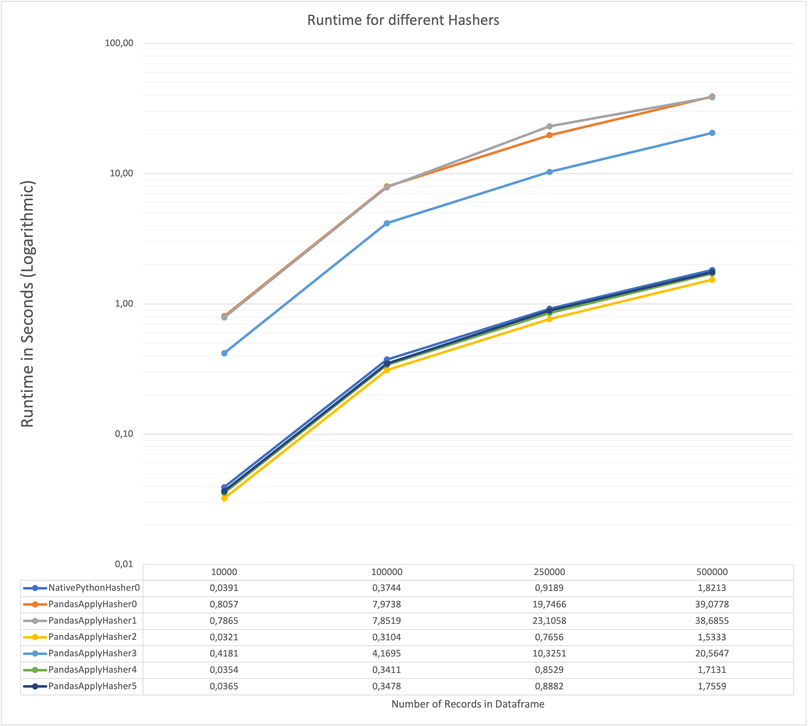

# Finding a fast column-hash implementation for pandas

> [Read the companion article](/2022/09/efficiently-hashing-columns-in-a-pandas-dataframe.html)!

Creating a hash over multiple columns should be fast.
In a project I accidentally created a slow but correct implementation and this is how I found a faster one.

## Try it yourself

- Install the requirements: `pip install -r requirements.txt`
- Run the script: `python3 pandas_hashing.py`
- Inspect the results in the csv.

## Results

